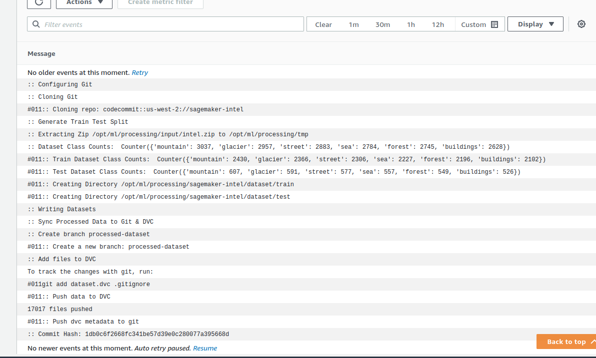
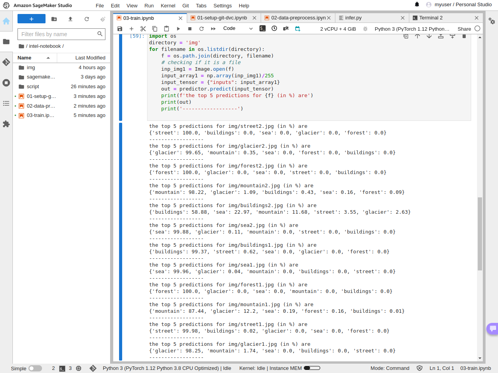

# EMLO Session 12

The goal of the assignment is to preprocess data, version control it, train a model, and run inference using custom sagemaker images.

# Build Custom Image
We build our custom images by inheriting for deep learning containers by AWS. Additional libraries will be installed. When we perform preprocessing, training, or inference, we won't need to install the prerequisites (this can be seen in the logs).
The preprocessing and inference containers use the CPU image and the training image use GPU-based image.
The docker files can be seen [here](./docker/)

To use these custom images, simply pass the `image_uri` argument. 

# Preprocessing

During preprocessing, the data is split into stratified splits of train and test. The data is cached to our s3 bucket named 'sagemaker-intel-dvc'. DVC stores its configuration in our codecommit repository named 'sagemaker-intel'.

The preprocessing logs can be seen here

The notebook can be seen [here](./notebooks/02-data-preprocess.ipynb)

## Training

The training logs can be seen [here](./img/train.png) (Only 2 epochs)

The tensorboard logs can be viewed [here](https://tensorboard.dev/experiment/9gDPY213Sg2eWD1asrWjVg/)

Please see the [notebook here](./notebooks/03-train.ipynb)

## Inference
All the preprocessing has been done inside the scripts, and not the notebooks.

The top 5 predictions for 2 samples from each category can be seen here.

